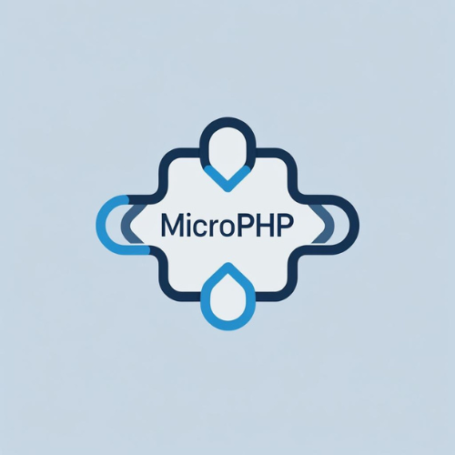

<div align="center">
  
  <h1>Microlite</h1>
  <p><strong>A modern, lightweight, PSR-15 compliant PHP microframework — zero bloat, full control.</strong></p>
  ...
</div>
<div align="center">

# Microlite

**A modern, lightweight, PSR-15 compliant PHP microframework — zero bloat, full control.**

[](https://php.net)
[](LICENSE)
[](https://packagist.org/packages/mhvefgh/microlite)
[](#testing)
[](https://packagist.org/packages/mhvefgh/microlite)

</div>

---

## Features

| Feature | Description |
|--------|-------------|
| **Zero Bloat** | Only what you need — no heavy dependencies |
| **FastRoute** | Blazing fast routing with `nikic/fast-route` |
| **Medoo DB** | Lightweight database layer (MySQL, PostgreSQL, SQLite) |
| **PSR-15 Middleware** | Full middleware stack support |
| **.env Config** | Environment-based configuration |
| **CLI Tools** | Built-in Symfony Console commands |
| **Testing Ready** | PHPUnit + example tests included |

---

## Installation

```bash
composer create-project mhvefgh/microlite my-app
cd my-app
cp .env.example .env
php -S localhost:8000 -t public

```
---
## Quick Start
** Open: http://localhost:8000

// public/index.php
$r->addRoute('GET', '/hello/{name}', ['App\Controllers\HomeController', 'hello']);


// app/Controllers/HomeController.php
namespace App\Controllers;


### Create Controller

```php
// app/Controllers/HomeController.php
<?php
namespace App\Controllers;

class HomeController
{
    public function hello($name)
    {
        return "<h1>Hello, {$name}!</h1>";
    }
}
```` ````
Visit: /hello/World → Hello, World!

## Project Structure

my-app/
├── app/              # Your controllers & middleware
├── public/           # Web entry point
├── src/              # Framework core
├── tests/            # PHPUnit tests
├── .env.example      # Environment template
└── composer.json     # Dependencies & autoload

## Testing

composer test

## Author

Mohammad Hossein Vefgh
Full-Stack Engineer | Open Source Contributor

GitHub: https://github.com/mhvefgh
Email: vefgh.m.hossein@gmail.com
LinkedIn: [https://www.linkedin.com/in/mohammad-hossein-vefgh-20b533164]


## License

MIT License © 2025 Mohammad Hossein Vefgh